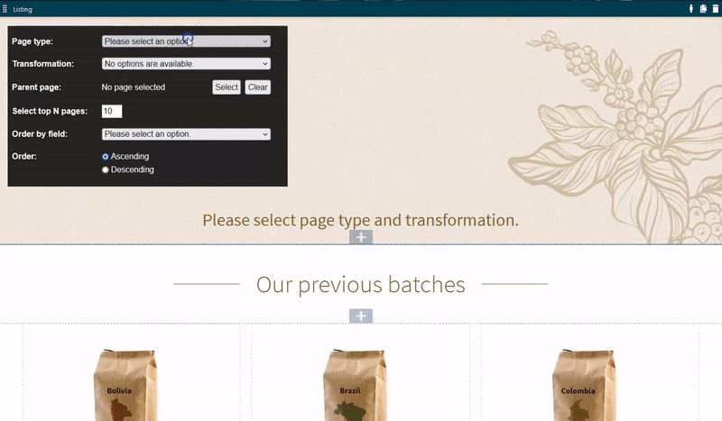

# General listing widget 

The general listing widget enables a content editor to display a customizable list of pages. 

Content editor can specify: 
- **Page type** - Type of pages to be displayed.
- **Transformation** - Layout of the listing.
- **Parent page** - Path to a page to display children for. The parent page itself is not included in the listing.
- **Select top N pages** - Number of pages to be displayed.
- **Order by field** - Field to order by the pages.
- **Order** - Order direction of the listing.



## How to use Listing widget

1. Listing widget is placed in the **Kentico.Xperience.ListingWidget project**. Copy the project to your solution.
2. In your project, add dependency to the listing widget project.
3. Set Xperience nugget version in the listing widget project same as it is on your live site. 
4. Register listing widget services trough [DI](https://docs.microsoft.com/en-us/aspnet/core/fundamentals/dependency-injection?view=aspnetcore-6.0).
    - For example you can use *AddListingWidgetServices()* extension method from *Kentico.Xperience.ListingWidget*: 
        ```
        public class Startup
        {
            ...
            public void ConfigureServices(IServiceCollection services)
            {
                ...
                // Registers services for listing widget
                services.AddListingWidgetServices();
                ...
            }
            ...
        }
        ```
5. Widget identifier is "Kentico.Xperience.ListingWidget", change your area restrictions according to it.
6. Add transformation services to your project and register them in DI - see below "How to add a transformation". 
7. Include css and js of the listing widget's in-line editors to your project (*Kentico.Xperience.ListingWidget/Assets/**/\*.css*, *Kentico.Xperience.ListingWidget/Assets/**/\*.js*).
    - If you want to use [Grunt](https://docs.xperience.io/developing-websites/developing-xperience-applications-using-asp-net-core/bundling-static-assets-of-builder-components), see *Gruntfile.js* in the **DancingGoatCore project**:
        ```
        grunt.initConfig({
            concat: {
                pageBuilder: {
                    files: {
                        // Styles - admin
                        'wwwroot/Content/Bundles/Admin/pageComponents.css': ['wwwroot/PageBuilder/Admin/**/*.css', '../Kentico.Xperience.ListingWidget/Assets/**/*.css'],
                        // Scripts - admin
                        'wwwroot/Content/Bundles/Admin/pageComponents.js': ['wwwroot/PageBuilder/Admin/**/*.js', '../Kentico.Xperience.ListingWidget/Assets/**/*.js'],
                    }
                }
            },
        }
        ```

8. Note: **Kentico.Xperience.ListingWidget project** has InternalsVisible settings for tests in the *Kentico.Xperience.ListingWidget/Properties/AssemblyInfo.cs*. 

## How to add a transformation

A preferred location for the transformation files is *{your_project}/Components/Widgets/ListingWidget/Transformations/{TransformationPageType}*. 

1. Create a **transformation view model** implementing *ITransformationViewModel*.
2. Create a **transformation razor view**. 
3. Create a **transformation service** implementing *BaseTransformationService*. The service should handle all transformations for a concrete type. 
    - Set the page type supported by transformation to the **PageType** field.
    - Add your new transformation to the **Transformations** collection.
    - Override other methods according to your needs.
    - For example:
        ```
        public class CafesTransformationService : BaseTransformationService
        {
            private readonly IPageAttachmentUrlRetriever attachmentUrlRetriever;
            private readonly IStringLocalizer<SharedResources> localizer;
            private readonly ICountryRepository countryRepository;

            public override string PageType { get; } = Cafe.CLASS_NAME;


            public override IEnumerable<Transformation> Transformations { get; } = new List<Transformation>
            {
                new Transformation
                {
                    Name = "Our cafes",
                    View = "Transformations/Cafes/_OurCafes.cshtml",
                    Description = "Transformation displays our cafes in 2 column grid.",
                }
            };


            public CafesTransformationService(IPageAttachmentUrlRetriever attachmentUrlRetriever,
                IStringLocalizer<SharedResources> localizer, ICountryRepository countryRepository)
            {
                this.attachmentUrlRetriever = attachmentUrlRetriever;
                this.localizer = localizer;
                this.countryRepository = countryRepository;
            }


            public override Action<DocumentQuery> GetCustomQueryParametrization(string transformationView)
            {
                return (query) => query.WhereTrue("CafeIsCompanyCafe");
            }


            public override ITransformationViewModel GetModel(IEnumerable<TreeNode> pages)
            {
                if (pages == null)
                {
                    return new CafesTransformationViewModel();
                }
                var cafesList = pages.Select(cafe => CafeViewModel.GetViewModel(cafe as Cafe, countryRepository, localizer, attachmentUrlRetriever));
                return new CafesTransformationViewModel { Cafes = cafesList };
            }
        }
        ```
4. Register your transformation services trough [DI](https://docs.microsoft.com/en-us/aspnet/core/fundamentals/dependency-injection?view=aspnetcore-6.0).
    - For example (see *DancingGoatCore/Helpers/IServiceCollectionExtensions.cs*):
        ```
        public static void AddDancingGoatListingWidgetTransformationServices(this IServiceCollection services)
        {
            services.AddSingleton<ITransformationService, ArticlesTransformationService>();
            services.AddSingleton<ITransformationService, CafesTransformationService>();
            services.AddSingleton<ITransformationService, CoffeesTransformationService>();
        }
        ```

See examples of the transformations in *DancingGoatCore/Components/Widgets/ListingWidget/Transformations*.