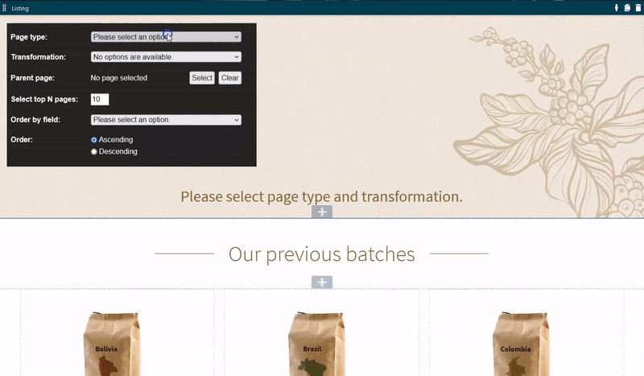

[](https://github.com/Kentico/xperience-listing-widget/actions/workflows/dotnet_build_and_test.yml)

# Page listing widget 

This repository provides a Listing widget for the Kentico Xperience [page builder](https://docs.xperience.io/x/Pg2RBg). The widget enables content editors to display a configurable list of content, loaded from the fields of structured pages on the website. The appearance of the list and the displayed data is based on transformations, which are implemented in advance by developers for individual page types.

Content editors can configure the following options for the widget:
- **Page type** - the [page type](https://docs.xperience.io/x/Vw2RBg) displayed in the list. Only one page type can be selected (you cannot mix multiple types in a single Listing widget).
- **Transformation** - the layout of the overall listing and the content of individual pages in the list. Hover over the help icon to read the description of the selected transformation.
- **Parent page** - the section of the site's content tree displayed in the listing. Only pages located under the selected parent page are included (direct child pages and further descendants). The parent page itself is not included in the listing. If the parent page is not selected, all pages of the specified page type on the site are listed.
- **Select top N pages** - the maximum number of pages in the list.
- **Order by field** - the field used to order pages in the list.
- **Order** - the ordering direction (ascending or descending).



The repository also contains a demonstration web project based on the Dancing Goat sample site: [DancingGoatCore](https://github.com/Kentico/xperience-listing-widget/tree/master/DancingGoatCore). The project includes modifications that integrate the Listing widget.

## Prerequisites

The Listing widget is compatible with any **Kentico Xperience 13** project using the **ASP.NET Core** development model. 

## Add the Listing widget to your project

Developers need to integrate and set up the Listing widget before it can be used on your website.

1. Download this repository.
2. Copy the **Kentico.Xperience.ListingWidget** folder to your working directory.
3. Open your Xperience solution in Visual Studio and add the **Kentico.Xperience.ListingWidget** project.
4. Reference the project from your main web project.
5. Ensure that your web project and the *Kentico.Xperience.ListingWidget* project use the same:
    - **Kentico.Xperience.AspNetCore.WebApp** NuGet package version
    - **Target framework**
6. Edit your web project's startup class (**Startup.cs** by default).
7. Register services for the Listing widget in the `ConfigureServices` method.
    - Call the `AddListingWidgetServices()` extension method (`Kentico.Xperience.ListingWidget` namespace) for the `IServiceCollection`:
        ```
        public void ConfigureServices(IServiceCollection services)
        {
            ...
            // Registers services for the Listing widget
            services.AddListingWidgetServices();
            ...
        }               
        ```
8. Adjust your Page Builder restrictions for [editable areas](https://docs.xperience.io/developing-websites/page-builder-development/creating-pages-with-editable-areas#Creatingpageswitheditableareas-Limitingcomponentsallowedinaneditablearea.2) and [widget zones](https://docs.xperience.io/developing-websites/page-builder-development/developing-page-builder-sections#Developingpagebuildersections-Limitingwidgetsallowedinzones) to allow the Listing widget.  
    - The Listing widget's identifier is: **Kentico.Xperience.ListingWidget**
9. Link the CSS and JavaScript files required by the Listing widget's inline editors to your website's pages.
    - We recommend setting up [bundling](https://docs.xperience.io/x/m4HvBg) for the following assets: 
        - *Kentico.Xperience.ListingWidget/Assets/**/\*.css*
        - *Kentico.Xperience.ListingWidget/Assets/**/\*.js*
    - For example, see the bundling process based on the [Grunt](https://gruntjs.com/) task runner in [DancingGoatCore/Gruntfile.js](https://github.com/Kentico/xperience-listing-widget/blob/master/DancingGoatCore/Gruntfile.js).
        ```
        grunt.initConfig({
            ...         
            concat: {
                ...             
                pageBuilder: {
                    files: {
                        // Styles - admin
                        'wwwroot/Content/Bundles/Admin/pageComponents.css': ['wwwroot/PageBuilder/Admin/**/*.css', '../Kentico.Xperience.ListingWidget/Assets/**/*.css'],
                        // Scripts - admin
                        'wwwroot/Content/Bundles/Admin/pageComponents.js': ['wwwroot/PageBuilder/Admin/**/*.js', '../Kentico.Xperience.ListingWidget/Assets/**/*.js'],
                    }
                }
            },
        }
        ```
10. Add transformations for your website's page types.

## Add transformations

The output of the Listing widget is defined by transformations, which need to be created by developers for every [page type](https://docs.xperience.io/x/Vw2RBg) that you wish to display in the listing. Transformations control both the overall layout of the listing and the content of individual pages in the list.

Use the following process to create a transformation for a page type:

1. Prepare a folder for Listing widget transformations in your Xperience web project. For example: *Components/Widgets/ListingWidget/Transformations/*
2. Create a **transformation view model** class implementing the `ITransformationViewModel` interface.
    - The model needs to hold a collection of items with the data of the pages displayed in the listing.
    - Tip: You can reuse the view models from your main web project for the items in the collection, if you already display pages of the given type.
        ```
        public class CafesTransformationViewModel : ITransformationViewModel
        {
            public IEnumerable<CafeViewModel> Cafes { get; set; }
        }
        ```
3. Create a **transformation view** with the output of the listing.
    - Display the data from your transformation view model.
    - The transformation view is rendered only once for the Listing widget, so you need to ensure the iteration of items (e.g., using a `foreach` statement).
        ```
        @model CafesTransformationViewModel

        <div class="row">
        @foreach (var cafe in Model.Cafes)
        {
            <div class="col-md-6">
                <div class="cafe-image-tile">
                    <div class="cafe-image-tile-image-wrapper">
                        @if (!string.IsNullOrEmpty(cafe.PhotoPath))
                        {
                            
                        }
                    </div>
                    <div class="cafe-image-tile-content">
                        <h3 class="cafe-image-tile-name">@cafe.Contact.Name</h3>
                        <address class="cafe-tile-address">
                            <div class="cafe-tile-address-anchor">
                                @cafe.Contact.Street, @cafe.Contact.City
                                <br />
                                @cafe.Contact.ZIP, @cafe.Contact.Country, @cafe.Contact.State
                            </div>
                        </address>
                        <p>@cafe.Contact.Phone</p>
                        <p>@cafe.Note</p>
                    </div>
                </div>
            </div>
        }
        </div>
        ```
4. Create a **transformation service** class inheriting from `BaseTransformationService`. The service should handle all transformations for a specific page type. 
    - Override the `PageType` property and assign the code name of the supported page type.
    - Override the `Transformations` property and assign a collection with one or more `Transformation` objects. Set the following properties for each transformation:
        - `Name` - the name of the transformation displayed to users by the Listing widget.
        - `View` - the path to the transformation's view.
        - `Description` - a description displayed to users as a tooltip when they select the transformation.
    - Override the `GetModel(IEnumerable<TreeNode> pages)` method and convert the collection of `TreeNode` objects (pages) to your transformation view model.
    - Override other methods according to your needs.
    - For example:
        ```
        public class CafesTransformationService : BaseTransformationService
        {
            private readonly IPageAttachmentUrlRetriever attachmentUrlRetriever;
            private readonly IStringLocalizer<SharedResources> localizer;
            private readonly ICountryRepository countryRepository;

            public override string PageType { get; } = Cafe.CLASS_NAME;


            public override IEnumerable<Transformation> Transformations { get; } = new List<Transformation>
            {
                new Transformation
                {
                    Name = "Our cafes",
                    View = "~/Components/Widgets/ListingWidget/Transformations/Cafes/_OurCafes.cshtml",
                    Description = "Displays cafes in a 2 column grid.",
                }
            };


            public CafesTransformationService(IPageAttachmentUrlRetriever attachmentUrlRetriever, 
            IStringLocalizer<SharedResources> localizer, ICountryRepository countryRepository)
            {
                this.attachmentUrlRetriever = attachmentUrlRetriever;
                this.localizer = localizer;
                this.countryRepository = countryRepository;
            }


            public override Action<DocumentQuery> GetCustomQueryParametrization(string transformationView)
            {
                return (query) => query.WhereTrue("CafeIsCompanyCafe");
            }


            public override ITransformationViewModel GetModel(IEnumerable<TreeNode> pages)
            {
                if (pages == null)
                {
                    return new CafesTransformationViewModel();
                }
                var cafesList = pages.Select(cafe => CafeViewModel.GetViewModel(cafe as Cafe, countryRepository, localizer, attachmentUrlRetriever));
                return new CafesTransformationViewModel { Cafes = cafesList };
            }
        }
        ```
5. Register your transformation services in your web project via [Dependency injection](https://docs.microsoft.com/en-us/aspnet/core/fundamentals/dependency-injection).
    - Add the transformation services to the `IServiceCollection` in your application's startup code, as singleton implementations of the `ITransformationService`interface.
    - For example (see [DancingGoatCore/Helpers/IServiceCollectionExtensions.cs](https://github.com/Kentico/xperience-listing-widget/blob/master/DancingGoatCore/Helpers/IServiceCollectionExtensions.cs)):
        ```
        public static void AddDancingGoatListingWidgetTransformationServices(this IServiceCollection services)
        {
            services.AddSingleton<ITransformationService, ArticlesTransformationService>();
            services.AddSingleton<ITransformationService, CafesTransformationService>();
            services.AddSingleton<ITransformationService, CoffeesTransformationService>();
        }
        ```

Repeat the process for all page types that you wish to support in the Listing widget.

For examples of transformations, see this repository's [DancingGoatCore/Components/Widgets/ListingWidget/Transformations](https://github.com/Kentico/xperience-listing-widget/tree/master/DancingGoatCore/Components/Widgets/ListingWidget/Transformations) folder.
    
## Questions & Support

See the [Kentico home repository](https://github.com/Kentico/Home/blob/master/README.md) for more information about the products and general advice on submitting questions.
